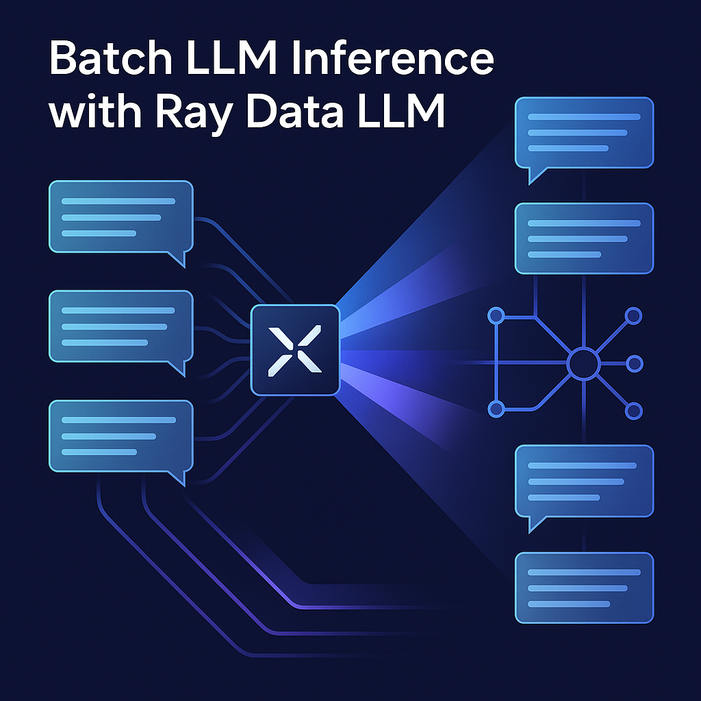
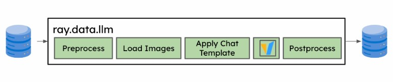
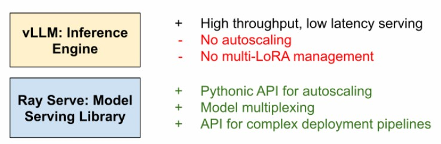

## 🧰 How to Use This Template    

Click the green **"Use this template"** button at the top of the page, then choose **"Create a new repository"**.   

This will create your own copy of this project, which you can modify freely — no need to fork!   

---    

<div align="center">
    
</div>

# Batch LLM Inference with Ray Data LLM

## Table of Contents

<details>
  <summary><a href="#1-about-this-repository"><i><b>1. About this Repository</b></i></a></summary>
  <div>
              <a href="#11-who-is-this-project-for">1.1. Who Is This Project For?</a><br>
              <a href="#12-what-will-you-learn">1.2. What Will You Learn?</a><br>
              <a href="#13-prerequisites">1.3. Prerequisites</a><br>
              <a href="#14-repository-structure">1.4. Repository Structure</a><br>
  </div>
</details>

<details>
  <summary><a href="#2-introduction"><i><b>2. Introduction</b></i></a></summary>
  <div>
              <a href="#21-ray">2.1. Ray</a><br>
              <a href="#22-ray-data-llm">2.2. Ray Data LLM</a><br>
              <a href="#23-problem-generate-responses-to-common-questions">2.3. Problem: Generate Responses to Common Questions</a><br>
              <a href="#24-what-you-want">2.4. What You Want</a><br>
              <a href="#25-how-ray-data-llm-helps">2.5. How Ray Data LLM Helps</a><br>
              <a href="#26-why-use-ray-data-llm">2.6. Why Use Ray Data LLM</a><br>
              <a href="#27-next-steps">2.7. Next Steps</a><br>
  </div>
</details>

<details>
  <summary><a href="#3-fundamental-level-generating-responses-to-common-questions"><i><b>3. Fundamental Level: Generating Responses to Common Questions</b></i></a></summary>
  <div>
              <a href="#31-problem">3.1. Problem</a><br>
              <a href="#32-example-questions">3.2. Example Questions</a><br>
              <a href="#33-why-batch-processing">3.3. Why Batch Processing</a><br>
              <a href="#34-real-life-example">3.4. Real-Life Example</a><br>
  </div>
</details>

<details>
  <summary><a href="#4-intermediate-level-text-generation-from-user-prompts"><i><b>4. Intermediate Level: Text Generation from User Prompts</b></i></a></summary>
  <div>
              <a href="#41-problem">4.1. Problem</a><br>
              <a href="#42-example-prompts">4.2. Example Prompts</a><br>
              <a href="#43-why-use-ray-data-llm">4.3. Why Use Ray Data LLM</a><br>
  </div>
</details>

<details>
  <summary><a href="#5-advanced-level-real-world-use-case"><i><b>5. Advanced Level: Real-World Use Case</b></i></a></summary>
  <div>
              <a href="#51-problem">5.1. Problem</a><br>
              <a href="#52-why-batch-processing">5.2. Why Batch Processing</a><br>
              <a href="#53-how-ray-data-llm-helps">5.3. How Ray Data LLM Helps</a><br>
  </div>
</details>

<details>
  <summary><a href="#6-announcing-native-llm-apis-in-ray-data-and-ray-serve"><i><b>6. Announcing Native LLM APIs in Ray Data and Ray Serve</b></i></a></summary>
  <div>
              <a href="#61-introduction">6.1. Introduction</a><br>
              <a href="#62-ray-data-llm">6.2. Ray Data LLM</a><br>
              <a href="#63-ray-serve-llm">6.3. Ray Serve LLM</a><br>
              <a href="#64-future-developments">6.4. Future Developments</a><br>
              <a href="#65-additional-resources">6.5. Additional Resources</a><br>
  </div>
</details>

<details>
  <summary><a href="#7-hardware-requirements-and-testing-environment"><i><b>7. Hardware Requirements and Testing Environment</b></i></a></summary>
  <div>
              <a href="#testing-environment">7.1. Testing Environment</a><br>
              <a href="#hardware-recommendations">7.2. Hardware Recommendations</a><br>
  </div>
</details>

<details>
  <summary><a href="#8-getting-started"><i><b>8. Getting Started</b></i></a></summary>
  <div>
              <a href="#installation-and-setup">8.1. Installation and Setup</a><br>
              <a href="#running-examples">8.2. Running Examples</a><br>
              <a href="#data-processing">8.3. Data Processing</a><br>
              <a href="#shutting-down">8.4. Shutting Down</a><br>
  </div>
</details>

<details>
  <summary><a href="#9-working-with-llama-models"><i><b>9. Working with Llama Models</b></i></a></summary>
  <div>
              <a href="#hardware-considerations">9.1. Hardware Considerations</a><br>
              <a href="#model-acquisition-and-storage">9.2. Model Acquisition and Storage</a><br>
              <a href="#setup-requirements">9.3. Setup Requirements</a><br>
              <a href="#performance-optimization-tips">9.4. Performance Optimization Tips</a><br>
  </div>
</details>

<details>
  <summary><a href="#10-data-formats-and-requirements"><i><b>10. Data Formats and Requirements</b></i></a></summary>
  <div>
              <a href="#101-input-data-format">10.1. Input Data Format</a><br>
              <a href="#102-example-data-structures">10.2. Example Data Structures</a><br>
              <a href="#103-processing-custom-data">10.3. Processing Custom Data</a><br>
              <a href="#104-data-storage-and-volume-considerations">10.4. Data Storage and Volume Considerations</a><br>
  </div>
</details>

<details>
  <summary><a href="#11-model-management-and-cicd-considerations"><i><b>11. Model Management and CI/CD Considerations</b></i></a></summary>
  <div>
              <a href="#111-model-distribution-practices">11.1. Model Distribution Practices</a><br>
              <a href="#112-cicd-pipeline-configuration">11.2. CI/CD Pipeline Configuration</a><br>
              <a href="#113-docker-image-optimization">11.3. Docker Image Optimization</a><br>
              <a href="#114-collaborative-development">11.4. Collaborative Development</a><br>
  </div>
</details>

<details>
  <summary><a href="#12-production-deployment"><i><b>12. Production Deployment</b></i></a></summary>
  <div>
              <a href="#121-scaling-considerations">12.1. Scaling Considerations</a><br>
              <a href="#122-high-availability-setup">12.2. High-Availability Setup</a><br>
              <a href="#123-monitoring-and-observability">12.3. Monitoring and Observability</a><br>
              <a href="#124-security-best-practices">12.4. Security Best Practices</a><br>
              <a href="#125-cost-optimization">12.5. Cost Optimization</a><br>
  </div>
</details>

<details>
  <summary><a href="docs/jargon.md"><i><b>13. Technical Jargon Glossary</b></i></a></summary>
  <div>
              A comprehensive glossary of technical terms and concepts used in this project.
  </div>
</details>

## 1. About this Repository

This project demonstrates how to perform batch inference with Large Language Models (LLMs) using Ray Data LLM. It provides a comprehensive guide to efficiently process multiple inputs simultaneously, making LLM inference faster and more scalable.

### 1.1. Who Is This Project For?

This project is designed for:

- **ML Engineers** looking to scale LLM inference for production applications
- **Data Scientists** working with large datasets that require LLM processing
- **NLP Researchers** exploring efficient ways to run experiments on large text corpora
- **DevOps Engineers** interested in optimizing infrastructure for LLM workloads
- **Software Developers** building applications that leverage LLMs

### 1.2. What Will You Learn?

By the end of this project, you will:

- Understand the fundamentals of batch processing with LLMs
- Learn how to use Ray Data LLM for efficient distributed inference
- Implement scalable text generation pipelines
- Configure vLLM and other inference engines for optimal performance
- Deploy LLM services with Ray Serve
- Create end-to-end workflows for various text processing tasks
- Optimize hardware resource utilization for LLM workloads

### 1.3. Prerequisites

This project is suitable for three types of learners:

- **For those familiar with Ray and LLMs:**
  - You can dive straight into the advanced examples and Ray Data LLM APIs. The examples and configurations provided will help you enhance your skills and explore best practices.
- **For those who know Python/ML but are new to Ray or batch LLM inference:**
  - This project will introduce you to Ray's distributed computing capabilities and guide you through implementing scalable LLM processing pipelines.
- **For beginners:**
  - Start with the fundamental concepts in Section 2 and work through the examples progressively. Each section builds on the previous one, helping you develop a solid understanding of batch LLM inference.

### 1.4. Repository Structure

```
Folder PATH listing
.
+---docker                              <-- Docker configuration for Ray cluster
|       README.md                       <-- Documentation for Docker setup
|       docker-compose.yml              <-- Defines Ray head and worker services
|       Dockerfile                      <-- Base image for Ray containers
|
+---docs                                <-- Documentation files
|       README.md                       <-- Documentation overview
|       jargon.md                       <-- Technical jargon glossary
|       reference_article.md            <-- Markdown version of the Ray LLM article 
|       reference_article.pdf           <-- PDF version of the Ray LLM article
|
+---figures                             <-- Contains images for documentation
|       README.md                       <-- Documentation for the figures folder
|       logo.png                        <-- Project logo
|       ray_data_llm.jpg                <-- Ray Data LLM architecture diagram
|       vLLM_vs_Ray-Serve.jpg           <-- Comparison illustration
|
+---notebooks                           <-- Jupyter notebooks
|       README.md                       <-- Documentation for the notebooks folder
|       llama_batch_inference.ipynb     <-- Llama 3.1 batch inference examples
|       ray_data_llm_test.ipynb         <-- Basic Ray Data LLM test notebook
|
+---scripts                             <-- Python scripts
|       README.md                       <-- Documentation for the scripts folder
|       ray_data_llm_haiku_example.py   <-- Example script for haiku generation
|       ray_serve_llm_deployment.py     <-- Example Ray Serve LLM deployment
|       openai_client_query.py          <-- Example for querying with OpenAI client
|
|   .gitignore                          <-- Files to exclude from git
|   LICENSE                             <-- License information
|   README.md                           <-- This documentation file
|   requirements.txt                    <-- Python dependencies
```

## 2. Introduction

Think about a customer support bot that receives 1000 similar questions every day. Instead of answering each one as it comes, you could collect the questions and process them in bulk (Batch processing), giving quick responses to all of them at once.

Batch processing is essential when generating text responses efficiently using large language models (LLMs). Instead of processing each input one by one, batch inference allows the handling of multiple inputs at once, making it faster and more scalable.

In this tutorial, we will start with a straightforward problem to introduce the concept of batch inference with Ray Data LLM. We will then progress to more advanced scenarios, gradually building your understanding and skills.

### 2.1. Ray

Ray is an open-source framework for building and running distributed applications. It enables developers to scale Python applications from a single machine to a cluster, making parallel computing more accessible. Ray provides a unified API for various tasks such as data processing, model training, and inference.

Key Features:

* Distributed computing made easy with Pythonic syntax
* Built-in support for machine learning workflows
* Libraries for hyperparameter tuning (Ray Tune), model serving (Ray Serve), and data processing (Ray Data)
* Scales seamlessly from a single machine to a large cluster

### 2.2. Ray Data LLM

Ray Data LLM is a module within Ray designed for batch inference using large language models (LLMs). It allows developers to perform batch text generation efficiently by integrating LLM processing into existing Ray Data pipelines.

Key Features:

* Batch Processing:
  * Simultaneous processing of multiple inputs for faster throughput
* Efficient Scaling:
  * Distributes tasks across multiple CPUs/GPUs
* Seamless Integration:
  * Works with popular LLMs like Meta Llama
* OpenAI Compatibility:
  * Easily integrates with OpenAI API endpoints

By using Ray Data LLM, developers can scale their LLM-based applications without the hassle of manual optimization or distributed computing setups.

### 2.3. Problem: Generate Responses to Common Questions

Imagine you have a list of common questions people might ask a chatbot. Instead of responding to each question one by one, you want to generate answers for all the questions at once.

#### 2.3.1. Example Questions:

1. "What is the weather like today?"
2. "Tell me a joke."
3. "Give me a motivational quote."
4. "What is 2+2?"

### 2.4. What You Want:

Instead of sending each question to the chatbot separately, you want to batch process them all at once, saving time and computing resources.

### 2.5. How Ray Data LLM Helps:

* **Batch Processing:** Instead of generating responses one by one, Ray Data LLM lets you process all questions simultaneously.
* **Efficient Scaling:** If you have 1000 questions, the system can distribute the workload across multiple processors, making it much faster.

### 2.6. Why Use Ray Data LLM?

Ray Data LLM integrates seamlessly with existing Ray Data pipelines, allowing for efficient batch inference with LLMs. It enables:

* High-throughput processing
* Distributed execution
* Integration with OpenAI-compatible endpoints
* Support for popular LLMs like Meta Llama

### 2.7. Next Steps

Ray Data LLM provides a simple and scalable way to perform batch inference using LLMs. Starting from basic chatbot responses to complex sentiment analysis, it enables high-throughput text generation and processing.

* Set up Ray and Ray Data on your system.
* Follow the provided code examples to implement the discussed problems.
* Experiment with different models and configurations for better performance.

## 3. Fundamental Level: Generating Responses to Common Questions

### 3.1. Problem

Imagine you have a list of common questions that people might ask a chatbot. Instead of generating a response for each question one by one, you want to generate answers for all the questions at once.

#### 3.2. Example Questions:

1. "What is the weather like today?"
2. "Tell me a joke."
3. "Give me a motivational quote."
4. "What is 2+2?"

### 3.3. Why Batch Processing?

Instead of sending each question to the chatbot separately, batch processing allows you to process all questions simultaneously, saving time and computing resources.

#### 3.4. Real-Life Example

Think about a customer support bot that receives thousands of similar questions daily. Instead of answering each one as it arrives, you could collect them and process them all at once, providing quick responses efficiently.

## 4. Intermediate Level: Text Generation from User Prompts

### 4.1. Problem

Now, imagine you have a list of user prompts for creative text generation. Instead of generating each text separately, you want to create a pipeline that processes all prompts together.

#### 4.2. Example Prompts:

* "Write a haiku about nature."
* "Generate a short story about space exploration."
* "Summarize the following paragraph..."

### 4.3. Why Use Ray Data LLM?

* You can use Ray Data to load a large number of prompts at once.
* Ray Data LLM allows you to batch process these prompts with the selected LLM model.

## 5. Advanced Level: Real-World Use Case

### 5.1. Problem

You have a dataset containing thousands of social media posts. You want to classify the sentiment (positive, negative, neutral) of each post using an LLM.

### 5.2. Why Batch Processing?

Performing sentiment analysis on each post individually would take too much time. By batching, you can classify the entire dataset at once.

#### 5.3. How Ray Data LLM Helps:

* Efficiently loads the dataset.
* Applies the LLM processor to generate sentiment labels.
* Uses distributed processing to handle large volumes of data efficiently.

## 6. Announcing Native LLM APIs in Ray Data and Ray Serve

By The Anyscale Team | April 2, 2025

### 6.1 Introduction

Today, we're excited to announce native APIs for LLM inference with Ray Data and Ray Serve.

As LLMs become increasingly central to modern AI infrastructure deployments, platforms require the ability to deploy and scale these models efficiently. While Ray Data and Ray Serve are suitable for this purpose, developers have to write a sizable amount of boilerplate in order to leverage the libraries for scaling LLM applications.

In Ray 2.44, we're announcing **Ray Data LLM** and **Ray Serve LLM**.

- **Ray Data LLM** provides APIs for offline batch inference with LLMs within existing Ray Data pipelines
- **Ray Serve LLM** provides APIs for deploying LLMs for online inference in Ray Serve applications.

Both modules offer first-class integration for vLLM and OpenAI compatible endpoints.

### 6.2 Ray Data LLM

The `ray.data.llm` module integrates with key large language model (LLM) inference engines and deployed models to enable LLM batch inference.

Ray Data LLM is designed to address several common developer pains around batch inference:

- We saw that many users were building ad-hoc solutions for high-throughput batch inference. These solutions would entail launching many online inference servers and build extra proxying/load balancing utilities to maximize throughput. To address this, we wanted to leverage Ray Data and take advantage of pre-built distributed data loading and processing functionality.
- We saw common patterns of users sending batch data to an existing inference server. To address this, we wanted to make sure that users could integrate their data pipelines with an OpenAI compatible API endpoint, and provide the flexibility for the user to be able to templatize the query sent to the server.
- We saw that users were integrating LLMs into existing Ray Data pipelines (chaining LLM post-processing stages). To address this, we wanted to make sure that the API was compatible with the existing lazy and functional Ray Data API.



With Ray Data LLM, users create a Processor object, which can be called on a Ray Data Dataset and will return a Ray Data dataset. The processor object will contain configuration like:

- Prompt and template
- OpenAI compatible sampling parameters, which can be specified per row
- vLLM engine configuration, if applicable

```python
import ray
from ray.data.llm import vLLMEngineProcessorConfig, build_llm_processor
import numpy as np

config = vLLMEngineProcessorConfig(
    model="meta-llama/Llama-3.1-8B-Instruct",
    engine_kwargs={
        "enable_chunked_prefill": True,
        "max_num_batched_tokens": 4096,
        "max_model_len": 16384,
    },
    concurrency=1,
    batch_size=64,
)
processor = build_llm_processor(
    config,
    preprocess=lambda row: dict(
        messages=[
            {"role": "system", "content": "You are a bot that responds with haikus."},
            {"role": "user", "content": row["item"]}
        ],
        sampling_params=dict(
            temperature=0.3,
            max_tokens=250,
        )
    ),
    postprocess=lambda row: dict(
        answer=row["generated_text"],
        **row  # This will return all the original columns in the dataset.
    ),
)

ds = ray.data.from_items(["Start of the haiku is: Complete this for me..."])

ds = processor(ds)
ds.show(limit=1)
```

In this particular example, the Processor object will:

- Perform the necessary preprocessing and postprocessing to handle LLM outputs properly
- Instantiate and configure multiple vLLM replicas, depending on specified concurrency and provided engine configurations. Each of these replicas can themselves be distributed as well.
- Continuously feed each replica by leveraging async actors in Ray to take advantage of continuous batching and maximize throughput
- Invoke various Ray Data methods (`map`, `map_batches`) which can be fused and optimized with other preprocessing stages in the pipeline by Ray Data during execution.

As you can see, Ray Data LLM can easily simplify the usage of LLMs within your existing data pipelines. See the documentation for more details.

### 6.3 Ray Serve LLM

Ray Serve LLM APIs allow users to deploy multiple LLM models together with a familiar Ray Serve API, while providing compatibility with the OpenAI API.

Ray Serve LLM is designed with the following features:

- Automatic scaling and load balancing
- Unified multi-node multi-model deployment
- OpenAI compatibility
- Multi-LoRA support with shared base models
- Deep integration with inference engines (vLLM to start)
- Composable multi-model LLM pipelines

While vLLM has grown rapidly over the last year, we have seen a significant uptick of users leveraging Ray Serve to deploy vLLM for multiple models and program more complex pipelines.

For production deployments, Ray Serve + vLLM are great complements.



vLLM provides a simple abstraction layer to serve hundreds of different models with high throughput and low latency. However, vLLM is only responsible for single model replicas, and for production deployments you often need an orchestration layer to be able to autoscale, handle different fine-tuned adapters, handle distributed model-parallelism, and author multi-model, compound AI pipelines that can be quite complex.

Ray Serve is built to address the gaps that vLLM has for scaling and productionization. Ray Serve offers:

- Pythonic API for autoscaling
- Built-in support for model multiplexing
- Provides a Pythonic, imperative way to write complex multi-model / deployment pipelines
- Has first-class support for distributed model parallelism by leveraging Ray.

Below is a simple example of deploying a Qwen model with Ray Serve on a local machine with two GPUs behind an OpenAI-compatible router, then querying it with the OpenAI client.

```python
from ray import serve
from ray.serve.llm import LLMConfig, LLMServer, LLMRouter

llm_config = LLMConfig(
    model_loading_config=dict(
        model_id="qwen-0.5b",
        model_source="Qwen/Qwen2.5-0.5B-Instruct",
    ),
    deployment_config=dict(
        autoscaling_config=dict(
            min_replicas=1, max_replicas=2,
        )
    ),
    # Pass the desired accelerator type (e.g. A10G, L4, etc.)
    accelerator_type="A10G",
    # You can customize the engine arguments (e.g. vLLM engine kwargs)
    engine_kwargs=dict(
        tensor_parallel_size=2,
    ),
)

# Deploy the application
deployment = LLMServer.as_deployment(
    llm_config.get_serve_options(name_prefix="vLLM:")).bind(llm_config)
llm_app = LLMRouter.as_deployment().bind([deployment])
serve.run(llm_app)
```

And then you can query this with the OpenAI Python API:

```python
from openai import OpenAI

# Initialize client
client = OpenAI(base_url="http://localhost:8000/v1", api_key="fake-key")

# Basic chat completion with streaming
response = client.chat.completions.create(
    model="qwen-0.5b",
    messages=[{"role": "user", "content": "Hello!"}],
    stream=True
)

for chunk in response:
    if chunk.choices[0].delta.content is not None:
        print(chunk.choices[0].delta.content, end="", flush=True)
```

Ray Serve LLM can also be deployed on Kubernetes by using KubeRay. Take a look at the Ray Serve production guide for more details.

### 6.4 Future Developments

Give these new features a spin and let us know your feedback! If you're interested in chatting with developers, feel free to join the Ray Slack or participate on Discourse, and follow the roadmap for Ray Serve LLM and Ray Data LLM for future updates.

### 6.5 Additional Resources

- [Ray Data LLM Documentation](https://docs.ray.io/en/latest/ray-data/llm.html)
- [Ray Serve LLM Documentation](https://docs.ray.io/en/latest/serve/llm.html)
- [Ray Slack](https://ray-distributed.slack.com)
- [Ray Discourse](https://discuss.ray.io)
- [Ray Serve Production Guide](https://docs.ray.io/en/latest/serve/production-guide.html)
- [Ray Roadmap](https://docs.ray.io/en/latest/roadmap.html)
- [KubeRay](https://github.com/ray-project/kuberay)

## 7. Hardware Requirements and Testing Environment

This project has been tested on the following hardware setup:

### Testing Environment

- **CPU**: Intel Core i7-10875H @ 2.30GHz (8 cores, 16 threads)
- **RAM**: 32GB DDR4
- **GPU**: NVIDIA GeForce RTX 2080 with 8GB VRAM
- **Storage**: SSD (recommended for faster model loading)
- **Operating System**: Ubuntu 22.04 LTS (WSL)

### Hardware Recommendations

For optimal performance with Ray Data LLM and Ray Serve LLM, consider the following hardware guidelines:

- **Minimum Requirements**:
  - 4-core CPU
  - 16GB RAM
  - NVIDIA GPU with at least 6GB VRAM (for running smaller models)
  - 50GB free disk space

- **Recommended for Production**:
  - 8+ core CPU
  - 32GB+ RAM
  - NVIDIA GPU with 8GB+ VRAM (RTX 2080 or better)
  - SSD storage with 100GB+ free space

For larger models (such as Llama-3.1-70B), more substantial GPU resources or a multi-GPU setup is required. The examples in this repository are configured to run on the testing environment specified above and may need adjustment for your specific hardware configuration.

## 8. Getting Started

### Installation and Setup

This project uses Docker to ensure a consistent environment across different systems. Follow these steps to get started:

#### Prerequisites

- Docker and Docker Compose installed on your system
- Git for cloning the repository
- At least 16GB RAM and 4 CPU cores
- 50GB of free disk space

#### Step 1: Clone the Repository

```bash
git clone https://github.com/yourusername/Batch_LLM_Inference_with_Ray_Data_LLM.git
cd Batch_LLM_Inference_with_Ray_Data_LLM
```

#### Step 2: Build and Start Docker Containers

```bash
cd docker
docker-compose build
docker-compose up -d
```

This will:
- Build the Docker images with all required dependencies
- Start two containers:
  - `ray-head`: The Ray cluster head node for coordinating distributed computation
  - `ray-jupyter`: A Jupyter Lab environment connected to the Ray cluster

#### Step 3: Access Jupyter Lab

Open your web browser and navigate to:
```
http://localhost:8888
```

No password is required (configured for development purposes).

### Running Examples

The repository contains several ways to explore batch LLM inference with Ray:

#### 1. Jupyter Notebooks

Navigate to the `notebooks` directory in Jupyter Lab to find:
- `ray_data_llm_test.ipynb`: A comprehensive notebook demonstrating Ray Data LLM functionality
- `batch_inference_example.ipynb`: Original example notebook

Execute the cells sequentially to understand how batch inference works with Ray Data LLM.

#### 2. Python Scripts

The `scripts` directory contains standalone Python scripts:

- `ray_data_llm_haiku_example.py`: Demonstrates batch inference with a Llama model to generate haikus
- `ray_serve_llm_deployment.py`: Shows how to deploy a Qwen model with Ray Serve
- `openai_client_query.py`: Illustrates how to query a Ray Serve LLM deployment

You can run these scripts from inside the Jupyter environment or directly in the container:

```bash
# From your host machine
docker exec -it ray-jupyter python /app/scripts/ray_data_llm_haiku_example.py
```

#### Note on Temporary Files

When you run Ray, it creates a `tmp` directory at the project root to store session information, logs, and runtime resources. This directory:
- Contains temporary data that is regenerated each time Ray runs
- Is excluded from version control via .gitignore
- May grow in size during long-running operations
- Can be safely deleted when Ray is not running if you need to free up disk space

### Data Processing

The examples in this repository demonstrate how to process various types of textual data:

1. **Simple Questions**: Batch processing of common questions (What is the capital of France?, etc.)
2. **Creative Prompts**: Processing user prompts for text generation (Write a haiku about..., etc.)
3. **Social Media Analysis**: Using LLMs for sentiment analysis on batches of social media posts

To use your own data:
1. Prepare your data as a CSV, JSON, or a list of text items
2. Load the data using Ray Data's import functions
3. Process it using the LLM processor as shown in the examples

### Shutting Down

When you're done experimenting, shut down the Docker containers:

```bash
cd docker
docker-compose down
```

This will stop all containers and free up system resources.

## 9. Working with Llama Models

This repository includes support for Meta's Llama 3.1 models, which provide high-quality results but require careful hardware configuration. A dedicated notebook (`notebooks/llama_batch_inference.ipynb`) is provided for working with these models.

### Hardware Considerations

The Llama 3.1 models require significant GPU resources:

- **Llama-3.1-8B**: Requires 8GB+ VRAM (RTX 2080 or better)
- **Llama-3.1-70B**: Requires multi-GPU setup or specialized hardware

### Model Acquisition and Storage

#### Obtaining the Model

- **Access Requirements**: 
  - You need to request and be granted access to Meta's Llama models on [Hugging Face Hub](https://huggingface.co/meta-llama)
  - Generate a personal access token at https://huggingface.co/settings/tokens
  - Set the token as an environment variable: `export HUGGING_FACE_HUB_TOKEN='your_token_here'`

- **Download Process**:
  - First run will automatically download model weights (~5-6GB for Llama-3.1-8B)
  - Download typically takes 5-10 minutes depending on internet speed
  - Loading to GPU takes 30-90 seconds depending on hardware

#### Storage Location

- **Cache Directories**:
  - Hugging Face cache: `~/.cache/huggingface/hub/`
  - vLLM optimization cache: `~/.cache/vllm/`

- **Docker Persistence**:
  - To persist models between container restarts, add these volume mounts to docker-compose.yml:
    ```yaml
    volumes:
      - ../:/app
      - ~/.cache/huggingface:/root/.cache/huggingface
      - ~/.cache/vllm:/root/.cache/vllm
    ```

#### Storage Requirements

- Llama-3.1-8B: ~5-6GB disk space for model weights
- Additional ~1-2GB for tokenizer files and optimization data
- Total disk requirement: At least 10GB free space recommended

### Setup Requirements

1. **Hugging Face Access**:
   - You need a Hugging Face account with access to Meta Llama models
   - Generate a token at https://huggingface.co/settings/tokens
   - Set your token: `export HUGGING_FACE_HUB_TOKEN='your_token_here'`

2. **Docker Rebuild** (after updating repository):
   ```bash
   cd docker
   docker-compose build
   docker-compose up -d
   ```

### Performance Optimization Tips

For systems with limited GPU memory (8GB VRAM):

1. **Reduce Batch Size**: 
   ```python
   config = vLLMEngineProcessorConfig(
       model="meta-llama/Llama-3.1-8B-Instruct",
       batch_size=16,  # Reduced from default 64
       # ... other config ...
   )
   ```

2. **Limit Token Processing**:
   ```python
   engine_kwargs={
       "max_num_batched_tokens": 2048,  # Reduced from 4096
       "max_model_len": 8192,           # Reduced from 16384
       # ... other kwargs ...
   }
   ```

3. **Control GPU Memory Usage**:
   ```python
   engine_kwargs={
       "gpu_memory_utilization": 0.85,  # Controls memory allocation
       "enable_chunked_prefill": True,  # Helps with memory efficiency
       # ... other kwargs ...
   }
   ```

4. **System Recommendations**:
   - Close other GPU-intensive applications
   - Monitor memory usage with `nvidia-smi`
   - If using WSL, ensure GPU passthrough is properly configured

For complete examples and implementation details, see the dedicated Llama notebook.

## 10. Data Formats and Requirements

The effectiveness of batch LLM inference depends significantly on how your data is structured. This section covers the data formats supported by this project and requirements for optimal performance.

### 10.1. Input Data Format

Ray Data LLM accepts several input formats for batch processing:

- **Dictionary/JSON Format**: Most flexible format with multiple fields per record
  ```python
  [{"question": "What is Ray?", "context": "Ray is a framework for..."}, ...]
  ```

- **Simple Text List**: For straightforward prompts
  ```python
  ["Write a haiku about nature", "Explain quantum physics", ...]
  ```

- **Pandas DataFrame**: For data already in DataFrame format
  ```python
  df = pd.DataFrame({"question": ["What is Ray?", ...], "context": ["Ray is...", ...]})
  ds = ray.data.from_pandas(df)
  ```

- **CSV/JSON/Parquet Files**: For data stored in files
  ```python
  ds = ray.data.read_csv("questions.csv")
  # or
  ds = ray.data.read_json("prompts.json")
  ```

### 10.2. Example Data Structures

Different use cases require different data structures:

- **Simple Q&A**:
  ```python
  questions = [
      "What is the capital of France?",
      "How many planets are in our solar system?",
      "What is 2+2?"
  ]
  ds = ray.data.from_items([{"question": q} for q in questions])
  ```

- **Creative Generation**:
  ```python
  prompts = [
      "Write a haiku about artificial intelligence.",
      "Generate a short story about space exploration.",
      "Describe a futuristic city in three sentences."
  ]
  ds = ray.data.from_items([{"prompt": p} for p in prompts])
  ```

- **Context-Aware Responses**:
  ```python
  data = [
      {"context": "Ray is a framework for distributed computing.", 
       "question": "What is Ray used for?"},
      {"context": "Llama is an LLM developed by Meta.", 
       "question": "Who created the Llama model?"}
  ]
  ds = ray.data.from_items(data)
  ```

### 10.3. Processing Custom Data

To process your own data with Ray Data LLM:

1. **Prepare Your Data**: Convert your data into one of the supported formats
2. **Create a Ray Dataset**:
   ```python
   # From a list of dictionaries
   ds = ray.data.from_items(your_data)
   
   # From a file
   ds = ray.data.read_json("your_data.json")
   ```
3. **Configure the Processor**:
   ```python
   processor = build_llm_processor(
       config,
       preprocess=lambda row: dict(
           messages=[
               {"role": "system", "content": "You are a helpful assistant."},
               {"role": "user", "content": row["your_prompt_field"]}
           ],
           # Other parameters...
       ),
       # Postprocessing function...
   )
   ```
4. **Run Batch Processing**:
   ```python
   results = processor(ds)
   ```

### 10.4. Data Storage and Volume Considerations

- **Memory Requirements**: Each batch consumes memory proportional to the number of tokens
- **Scaling Guidelines**:
  - For 8GB VRAM: Limit to ~100-200 items per batch
  - For 16GB+ VRAM: Can process 500+ items per batch
- **Storage Format**: For large datasets (>10K items), use Parquet format for efficiency
  ```python
  ds.write_parquet("large_dataset.parquet")
  ds = ray.data.read_parquet("large_dataset.parquet")
  ```
- **Checkpointing**: For very large jobs, use checkpointing to save progress
  ```python
  ds.write_parquet("checkpoint_data.parquet")
  ```

For examples of different data processing approaches, refer to the notebooks in the `notebooks` directory.

## 11. Model Management and CI/CD Considerations

When working with large language models in collaborative environments or CI/CD pipelines, special considerations are needed to manage model weights efficiently.

### 11.1. Model Distribution Practices

Rather than storing model weights in version control:

- **Document Download Instructions**: Provide clear instructions for obtaining models
  ```markdown
  1. Request access at huggingface.co/meta-llama
  2. Generate an API token
  3. Set the HUGGING_FACE_HUB_TOKEN environment variable
  ```

- **Use Model Cards**: Create model cards documenting:
  - Model source and version
  - Required permissions
  - Hardware requirements
  - Fine-tuning details (if applicable)

- **Versioning**: Use specific model versions in your code
  ```python
  model="meta-llama/Llama-3.1-8B-Instruct" # Explicitly versioned
  # Instead of just "meta-llama/Llama"
  ```

### 11.2. CI/CD Pipeline Configuration

For continuous integration and deployment pipelines:

- **Environment Variables**: Set up secure environment variables for model access
  ```yaml
  # GitHub Actions example
  env:
    HUGGING_FACE_HUB_TOKEN: ${{ secrets.HUGGING_FACE_HUB_TOKEN }}
  ```

- **Caching Model Weights**:
  - Configure persistent cache volumes in CI runners
  ```yaml
  # Docker-based CI example
  volumes:
    - huggingface-cache:/root/.cache/huggingface
    - vllm-cache:/root/.cache/vllm
  ```

- **CI-Specific Models**: Consider using smaller models for testing
  ```python
  # Production code
  model = "meta-llama/Llama-3.1-8B-Instruct"
  
  # Test/CI code
  model = "TinyLlama/TinyLlama-1.1B-Chat-v1.0"
  ```

### 11.3. Docker Image Optimization

For containerized deployments:

- **Multi-Stage Builds**: Use smaller images for runtime
  ```dockerfile
  # Build stage with dependencies
  FROM python:3.10 AS builder
  
  # Runtime stage with minimal footprint
  FROM python:3.10-slim
  COPY --from=builder /app /app
  ```

- **Pre-download Models**: For specific production deployments
  ```dockerfile
  # Requires HF token at build time
  ARG HUGGING_FACE_HUB_TOKEN
  ENV HUGGING_FACE_HUB_TOKEN=${HUGGING_FACE_HUB_TOKEN}
  
  # Pre-download model during image build
  RUN python -c "from transformers import AutoModel; AutoModel.from_pretrained('meta-llama/Llama-3.1-8B-Instruct')"
  ```

- **Shared Cache Volumes**: In multi-container deployments
  ```yaml
  # docker-compose.yml
  volumes:
    model-cache:
      driver: local
  
  services:
    llm-service:
      volumes:
        - model-cache:/root/.cache/huggingface
  ```

### 11.4. Collaborative Development

When multiple team members work on the same project:

- **Centralized Model Storage**: Consider a team-accessible storage location
  ```python
  # Configure custom cache directory
  os.environ["TRANSFORMERS_CACHE"] = "/team/shared/model-cache"
  ```

- **Model Registry**: For teams working with fine-tuned models
  - Document model location and access method
  - Track model lineage and training parameters
  - Record benchmark performance metrics

For more details on CI/CD best practices, refer to the [Ray Production Guide](https://docs.ray.io/en/latest/serve/production-guide.html).

## 12. Production Deployment

This section provides guidance on transitioning this project from a development environment to a production-ready deployment. Following these practices will help you build a robust, scalable, and maintainable LLM inference system.

The `production/` directory contains ready-to-use configurations, scripts, and templates for deploying Ray Data LLM in production environments, including:

- Terraform configurations for cloud infrastructure (`production/terraform/`)
- Kubernetes manifests for Ray clusters and LLM services (`production/kubernetes/`)
- Monitoring and observability configurations (`production/monitoring/`)
- Deployment and utility scripts (`production/scripts/`)
- Production environment configuration files (`production/config/`)

To get started with a production deployment, refer to the [Production README](production/README.md) for step-by-step instructions.

### 12.1. Scaling Considerations

When deploying Ray Data LLM in production, consider these scaling strategies:

#### Horizontal vs. Vertical Scaling

- **Horizontal Scaling**: Add more worker nodes to your Ray cluster
  ```yaml
  # Example docker-compose.yml for horizontal scaling
  services:
    ray-head:
      # ...head node config...
    ray-worker-1:
      # ...worker config...
    ray-worker-2:
      # ...worker config...
    # Add more worker nodes as needed
  ```

- **Vertical Scaling**: Use more powerful hardware for each node
  - Recommended for GPU-intensive workloads
  - Optimize for models that benefit from larger VRAM

#### Auto-scaling Configuration

Ray clusters can be configured to auto-scale based on workload:

```python
# Example Ray autoscaling configuration
autoscaling_config = {
    "min_workers": 2,
    "max_workers": 10,
    "target_utilization_fraction": 0.8,
    "idle_timeout_minutes": 5,
}

# Use with Ray Serve LLM
llm_config = LLMConfig(
    # ...other config...
    deployment_config=dict(
        autoscaling_config=autoscaling_config
    )
)
```

#### Load Balancing

For high-throughput scenarios, configure your deployment with proper load balancing:

- Use Ray Serve's built-in load balancing for online inference
- For batch processing, partition data appropriately:
  ```python
  # Configure batch size based on load patterns
  config = vLLMEngineProcessorConfig(
      # ...other config...
      batch_size=dynamic_batch_size(),  # Function that determines optimal batch size
  )
  ```

### 12.2. High-Availability Setup

To ensure system reliability in production:

#### Multi-Zone Deployment

Deploy Ray clusters across multiple availability zones:

```yaml
# Kubernetes excerpt for multi-zone Ray cluster
apiVersion: ray.io/v1
kind: RayCluster
metadata:
  name: ray-llm-cluster
spec:
  # ...other spec items...
  podTypes:
    - name: head
      # ...head spec...
      nodeSelector:
        topology.kubernetes.io/zone: us-east-1a
    - name: worker-group-1
      # ...worker spec...
      nodeSelector:
        topology.kubernetes.io/zone: us-east-1b
    - name: worker-group-2
      # ...worker spec...
      nodeSelector:
        topology.kubernetes.io/zone: us-east-1c
```

#### Checkpoint and Recovery

Implement proper checkpointing for long-running batch processes:

```python
# Example checkpoint configuration
ds = ray.data.read_parquet("s3://bucket/input-data.parquet")
ds = processor(ds)

# Save checkpoint after processing
ds.write_parquet("s3://bucket/processed-data-checkpoint.parquet")
```

#### Health Checks and Self-Healing

Add health monitoring to your deployment:

```python
# Example Ray Serve health check configuration
@serve.deployment(
    health_check_period_s=10,
    health_check_timeout_s=30,
)
class HealthyLLMDeployment:
    # Deployment implementation
    pass
```

### 12.3. Monitoring and Observability

#### Metrics Collection

Implement comprehensive metrics collection:

```python
# Prometheus metrics example with Ray Serve
from ray import serve
from prometheus_client import Counter, Histogram

requests_counter = Counter('llm_requests_total', 'Total LLM requests')
latency_histogram = Histogram('llm_latency_seconds', 'LLM request latency')

@serve.deployment
class MonitoredLLMDeployment:
    def __call__(self, request):
        requests_counter.inc()
        with latency_histogram.time():
            # Process request
            result = self.model.generate(request)
        return result
```

#### Logging Strategy

Implement structured logging for better observability:

```python
# Structured logging example
import json
import logging
import time

def log_inference_event(request_id, model, input_tokens, output_tokens, duration_ms, success):
    log_entry = {
        "timestamp": time.time(),
        "request_id": request_id,
        "model": model,
        "input_tokens": input_tokens,
        "output_tokens": output_tokens,
        "duration_ms": duration_ms,
        "success": success
    }
    logging.info(json.dumps(log_entry))
```

#### Dashboards and Alerts

Create monitoring dashboards for:
- GPU utilization
- Request throughput
- Error rates
- Response latency
- Token usage

Set up alerts for critical thresholds:
- High error rates (>1%)
- Extended p95 latency (>2s)
- GPU memory approaching limits (>90% utilization)

### 12.4. Security Best Practices

#### API Authentication

Implement proper authentication for your endpoints:

```python
# Example Ray Serve authentication middleware
@serve.deployment
class AuthMiddleware:
    def __init__(self, app):
        self.app = app
        self.valid_keys = load_api_keys_from_secure_storage()
        
    async def __call__(self, request):
        auth_header = request.headers.get("Authorization")
        if not auth_header or not self._validate_token(auth_header):
            return {"error": "Unauthorized"}, 401
        return await self.app.handle_request(request)
        
    def _validate_token(self, auth_header):
        # Token validation logic
        if not auth_header.startswith("Bearer "):
            return False
        token = auth_header[7:]  # Remove "Bearer "
        return token in self.valid_keys
```

#### Model Access Control

Implement access controls for different models:

```python
# Example model access control
@serve.deployment
class ModelAccessController:
    def __init__(self):
        # Map of user roles to allowed models
        self.role_model_map = {
            "basic": ["small-model"],
            "premium": ["small-model", "medium-model"],
            "enterprise": ["small-model", "medium-model", "large-model"],
        }
    
    def check_access(self, user_role, requested_model):
        if user_role not in self.role_model_map:
            return False
        return requested_model in self.role_model_map[user_role]
```

#### Data Protection

Ensure proper data handling:

- Implement input/output filtering for sensitive information
- Set up appropriate data retention policies
- Use encryption for data at rest and in transit

### 12.5. Cost Optimization

#### Resource Allocation

Optimize resource allocation based on workload patterns:

```python
# Example of cost-optimized resource allocation
llm_config = LLMConfig(
    # ...other config...
    deployment_config=dict(
        autoscaling_config=dict(
            min_replicas=1,  # Start with minimum resources
            max_replicas=10,  # Scale up to max when needed
            target_utilization_fraction=0.8,  # Balance between cost and latency
        )
    )
)
```

#### Caching Strategy

Implement response caching for common queries:

```python
# Example caching implementation
import hashlib
from functools import lru_cache

@lru_cache(maxsize=1000)
def cached_llm_response(query_hash):
    # Retrieve from cache or generate new response
    pass

def get_llm_response(query):
    # Generate deterministic hash of the query
    query_hash = hashlib.md5(query.encode()).hexdigest()
    return cached_llm_response(query_hash)
```

#### Batch Scheduling

Schedule batch jobs during off-peak hours to reduce costs:

```python
# Example batch scheduling with Ray
@ray.remote
def process_batch(batch_data):
    # Process batch
    pass

# Schedule batch to run at specific time
batch_data = ray.data.read_parquet("s3://bucket/data.parquet")
ray.util.scheduling.schedule(
    process_batch.remote(batch_data),
    cron="0 2 * * *"  # Run at 2 AM daily
)
```

For a complete production deployment example, refer to the new `production` directory that includes Terraform configurations, Kubernetes manifests, monitoring setups, and comprehensive deployment scripts.

## 13. Technical Jargon Glossary

A comprehensive glossary of technical terms and concepts used in this project is available in the [Technical Jargon Glossary](docs/jargon.md).
